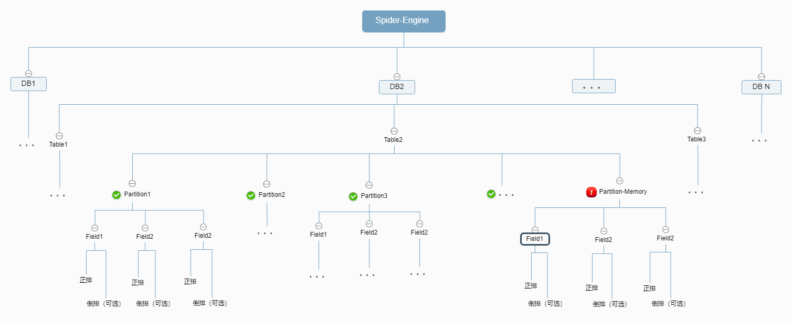
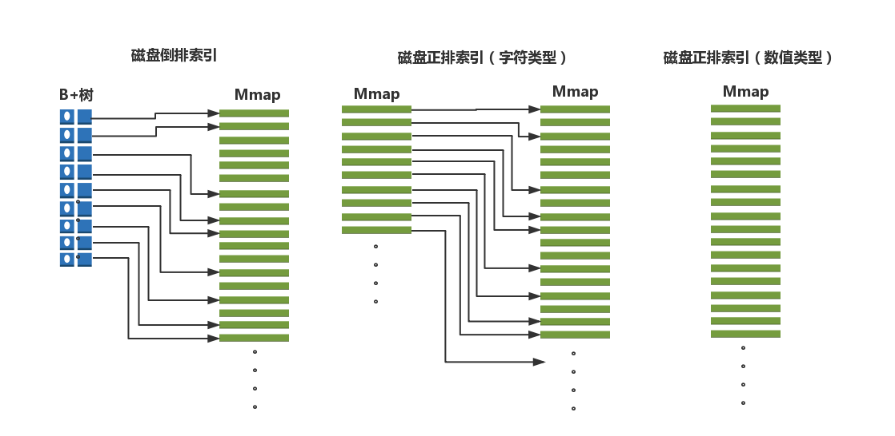

# 开发文档：
## 整体架构如图：

项目底层索引的实现，我参考了吴老师的：[博客](https://segmentfault.com/a/1190000004905748)。他通俗的讲解对于搜索引擎原理的学习很有帮助。

此外我也融入了不少我的理解并增加了不少的特性。下面是一些重要点的梳理。

## 概念解释：
	存储引擎很多概念相对类似、通用，但又有些许区别，这里统一对齐一下。
- 文档：存储的基本单位，是一条结构化了的数据，对等的，可以理解为Mysql表中的一条记录。
- 倒排：SE的底层存储结构，一个文档的字符内容，被分词之后，会形成多个词条，倒排就是一种映射关系，Map：词条=>文档Id。有了这个倒排映射，那么搜索功能将变得简单高效。
- 正排：SE的底层存储结构，相对于倒排的逆映射，文档Id=>字段内容。这主要用于结果的过滤以及完整文档的生成，例如一个文档的所有字段的正排合在一起，就是一个完整的文档内容。
- 字段：文档的基本组成单位，一个文档由多个字段组成，这和Mysql中的概念是一致的。在spider-engine中，每个字段都会拥有一个正排；字符类型的字段，可以拥有倒排。
- 索引过程：将文档数据各个字段生成可供搜索的倒排索引和正排索引的过程就是索引过程。在spider-engine中，当增加一个文档后，这一过程将自动进行。
- 表：类比于Mysql的表，多个拥有相同字段定义的文档，组成一张表。
- 库：类比于Mysql的库，表的管理容器，多个表组成一个库。
- 分区：类比于Mysql的分区，底层的存储结构，整体表的一部分数据（为了将来分布式、数据容错、数据迁移等预留想想空间），本质上一个分区就已经拥有完整的索引套件：正排+倒排+字段。能够执行独立的搜索，最终的搜索结果其实是各个分区独立搜索结果的并集。
- 检索：即搜索，即给定一个关键词或一句话，针对某个字段进行搜索。通常还会伴有过滤和排序等操作。本质上底层会用到倒排索引+正排索引。

**对照表：**
Mysql | ES | Spider-Engine
---|---|---
Database | Indexes| Database
Table| Index/Type| Table
Row| Document| Document
Column| Field| Field

## 核心存储的设计与实现：

### 倒排索引的实现：
根据搜索引擎的基本原理, 一个字段(列)需要支持搜索，那么其需要拥有一个倒排索引。具体倒排索引的原理：[解释](https://baike.baidu.com/item/倒排索引)。  

Spider倒排索引由一颗B+树和一个倒排文件搭配，宏观上可以看成一个Map（Key是分词后的各个Term，Val是Term对应的docId的列表）
其中：
- 	Key的部分基于B+树实现, 便于搜索和范围过滤。B+树我没有自己实现，而是采用了著名的BoltDb（Etcd也采用bolt），key是term, val则是term在倒排文件中的offset
-   Val的部分基于mmap实现的倒排文件，mmap的好处在于可以快速隐射磁盘内容到内存，使得程序可以像操作内存一样读取文件，极大提升访问速度
-   倒排文件: 由mmap实现，顺序的数据块, 每块数据长这个个样子
[nodeCnt(8Byte)|nodeStruct1|nodeStruct2|....][nodeCnt(8Byte)|nodeStruct1|nodeStruct3|....]....  
其中，nodeStuct:{docId: xx, weight: xx}

### 正排索引的实现：
正排索引，提供一个docId=>字段内容的映射。  
它的作用通常是用于字段信息的读取、最终查询结果过滤等方面。比如，一个文档的所有字段的正排索引合并，就是文档的完整内容。  
因为正排索引的特点（key是docId，是一个数字），实现上利用数组（slice），下标作为docId, 数组元素值作为实际的值，所以这也可看做一种map。

    Btw：  
    这里将docId作为key，是一种简化，实际上key是pos，pos的定义见下面分区实现解释。 
    所以，若磁盘态则通过baseMmap.Get(fwdOffset + (docId-startId)*DATA_BYTE_CNT)

正排索引的实现，还需要区分字段类型，如下：  
- 数字型：
	baseMmap当做一个[]int64数组来引用（每个元素占8个Byte）
- 字符型：
	需要baseMmap和extMmap配合使用  
	baseMmap当做一个[]int64数组来引用（每个元素占8个Byte），表示其在extMmap中的offset  
	extMmap实际存string的内容，格式如： [len|content][len|content][len|content]...

### 索引的实现图：
结合上面的描述，磁盘索引的实现结构如下图：  

### 字段的实现：
字段的概念，对等于Mysql中表的一列。一张表逻辑是有多个字段构成的（物理上还有一层分区，具体见下面描述）  
除了定义了字段本身信息，field的还有一个重要的作用，就是管理索引。在spider-engine中，一个field：  
- 必然会包含一个正排索引：因为获取字段内容总是必须的
- 可选的一个倒排索引：如果字段不需要搜索，或者是数字、时间等数值型的字段，那么不会建立倒排索引

### 分区的实现：
分区, 类比于Mysql的分区的概念，所有的分区合在一起, 就是一张完整的表，它有如下的特点
- 每个分区是独立的索引单元, 能够进行索引  
- 每个分区都拥有全量的filed（但是数据是整体表数据的一部分）  
- 同一个分区中的各个字段的共用同一套正、倒排文件(btdb, ivt, fwd, ext)  

    Btw：
    因为分区的这个特点（每个分区只是一部分的文档）所以正排索引的startDocId和nextDocId相当于分区的边界，左闭右开。
     - tartDocId表示在当前分区索引的起始docId
     - nextDocId表示在当前分区下一个新增doc期望的Id
     - 判断一个docId是否属于当前分区：startDocId <= docId < nextDocId
     - 每个分区中，正排索引实际的key并不是docId，而是的是pos = docId-startId

### 索引、字段、分区的状态：
索引、字段、分区都存在两种状态内存和磁盘。：
- 内存态：数据实体无论正排和倒排都存在内存中
- 磁盘态：当文档数满足落地阈值（可配置）时，Spider-engine会自动触发落地，分区

内存状态的特点：
- 内存态分区只会拥有内存态的字段和索引，反之磁盘态的分区也同样只会拥有磁盘态的字段和索引。
- 所有的文档新增操作，仅会发生在内存态的分区（字段、索引）中。修改和删除操作见下面说明。

    Btw：
    上面提到的正排、倒排索引实现均指的是磁盘态的实现，内存态正排和倒排实现相对比较简单。
    倒排直接就是一个map，正排则是一个slice。

### 分区的落地与合并：
因为新增的文档都会先存储在内存分区中，这样存在一个风险：如果机器宕机，这部分的信息将会丢失。  
所以文档不能永远存在内存中，必须要有一个落地机制spider采用了自动落地的方式解决这一问题。  
当新文档数满足落地阈值（支持配置）spider-engine会自动触发落地机制，将内存态分区=>磁盘态分区，并生成新的内存态分区。  

    为了控制落机器夯机等异常造成数据过多丢失，所以落地阈值不能够太大。但是落地阈值减小，会造成分区增多。增加了磁盘IO的负担。  
    为了解决这一矛盾，spider采用了自动分区合并的机制，在适当时机（满足合并阈值、程序启动等）spider会自动将小分区合并成较大分区。

### 主键字段：
一张表的文档如果需要支持删除和编辑，那么必须要拥有一个主键。在spider中，如果用户建表的时候不提供主键，spider将会在底层为用户自动创建一个隐藏的主键。

所有的字段中，主键字段是一个比较特殊的实现，主要原因是逐渐字段的一些特殊属性：
- 1. 主键是标记一个文档的唯一属性，但是，它不是docId，下面会介绍这么设计的原因
- 2. 一张表一旦确定了主键字段，则不能再变更主键
- 3. 主键字段的是一个一对一的双射关系primaryKey <=> docId
- 4. 主键的查询效率应该比一般的倒排字段更高

基于上面的特点，spider中，直接用boltDb存储主键，并且主键不属于分区，而是直接关联在表结构中，这样就省去
了跨字段查询的操作，速度将会更加迅猛。

### 文档的增、删、改、查：
- 增：将文档的各个字段，分别增加到内存分区中的各个字段中，在字段下面建立正排和倒排（如果有）
- 删：由于涉及到倒排，所以文档的删除非常复杂。spider-engine做了简化，利用bitmap实现了一个标记删除。
   关于bitmap的解释：链接。bitmap的'key'，是docId，这样，一张含有1.3亿多文档的表，也只需要一个16M的bitmap就够了。
- 改：本质上就是将旧的文档的docId用bitmap标记删除。然后新增一个文档并在主键字段中将primaryKey指向新的docId。
- 查：查分正向和反向两种场景
    - 	正向：根据主键查一个文档的记录，这个利用primaryKey查到docId后直接去对应分区中取出所有字段组合在一起。
    - 	反向：即所谓的搜索。给一个关键字，搜索文档中含有这个关键字的所有文档。这种就是搜索引擎针对于Mysql这种db的最大优势所在。  在Mysql中如果想这么干，就需要用到like '%xx%'，性能很感人。。。
         而在搜索引擎中，因为倒排的存在，将优美得多~
  
### 分词的实现：
spider目前还没有对分词进行过多的涉猎，所以直接引用了两个外部的依赖jiebago和sego。  
他们都是比较易用的分词器，简单高效。  

## 引擎层设计与实现

### 搜索的实现：
搜索的场景，是我们最为熟悉不过的，google、百度哪一天也离不开。  
给一个关键字或者一句话，回车，就能得到所有的文档。其实细分下来针对一张表的搜索也有两种情况
- 指定字段搜索：可以直接利用该字段的倒排索引，得到docId的集合，即可返回结果
- 未指定字段：这时需要支持跨多字段的倒排联合索引，spider的实现方案是，底层我隐藏了一个"上帝视角"字段，这个字段是所有需要建立倒排字段的合并，统一建立了一个跨字段上帝视角的倒排索引。

    Btw：
    该字段不对外暴露并且只有倒排索引没有正排索引以最大的限度的节省空间。

### 排序的实现：
默认使用文本相关性进行排序

### 一致性保证：
在架构图上可以看到，spider还是比较复杂的，从库=>表=>分区=>字段=>索引，有很多层，每个实体都有自己的诸多控制字段。  
并且由于分区是物理结构，字段是逻辑概念，所以本质上是一个网状的存储结构。假如有一个节点上出错，其他节点如何保证一致性感知，从而整体上保证正确性，这是比较复杂的。 

spider的实现方案是，当有写入操作发生的时候，各个实体不关心起他节点的正确性，只会保证自己节点完成工作。  
这样就可以保证至少各个节点是至少是完成了工作的，至于结果是否成功，是否出现了错误，则统一上抛，由表这一层统一处理。  
只要有一个节点发生了错误，那么本次写入操作将会整体失败，在表一层标记删除（此时由于底层各个节点无论是否正确执行都将被忽略，由于工作是完成了的，所以各个状态字段比如startDocId、nextDocId能够保证一致）

### 写操作 并行=>串行：
为了进一步保证一致性和正确性，我采取了另一个措施是"写入"操作串行化改造，所有的写入操作都将根据请求到来的先后，存入channel，由统一的goroutine来负责实际执行。  

    （这里指的是针对一张表的写操作，多张表之间仍然是并行的）

此外，为了防止瞬时大量写操作造成channel阻塞，还引入了一层cache，由专门的goroutine负责将cache中的请求放入channel。

    这里使用了较多的golang本身的特性，也体现了语言的优势。如果换成其他语言，这样的实现方案将会面临极大的心智成本负担，但是在golang中，一切都很自然。

### 读、写操作的并发：
将写操作串行化的一个附带好处是，即便瞬时有大量的写请求到来，也不会影响到读请求被调度满足。因为只会有一个goroutine进行写操作，那么同一时刻的读操作，必然有机会被调度进而满足。  
关于同时读写的操作，spider采用了读写锁sync.RWMutext来尽可能的兼顾各方效率。

## 介入层设计与实现